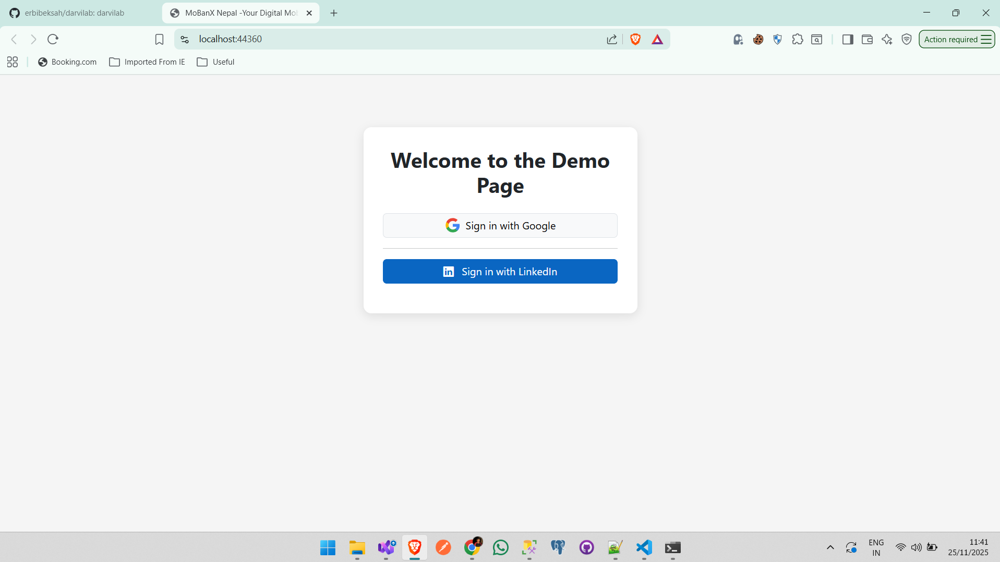
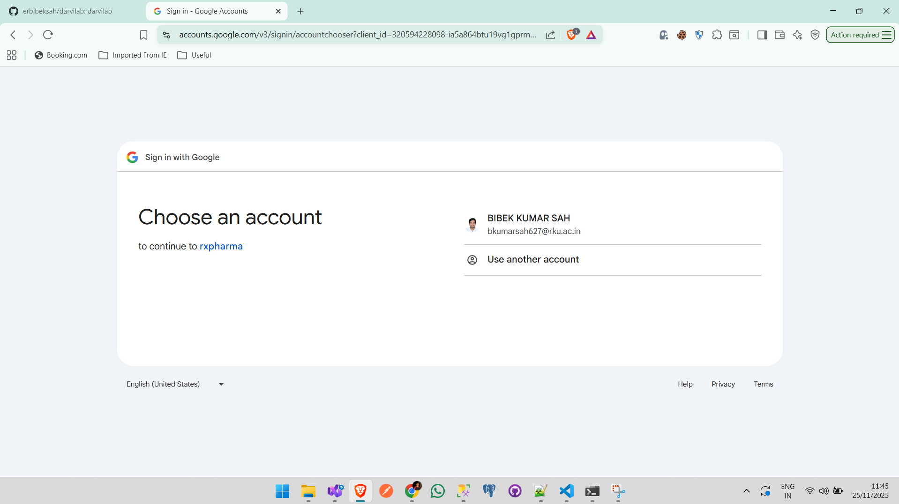
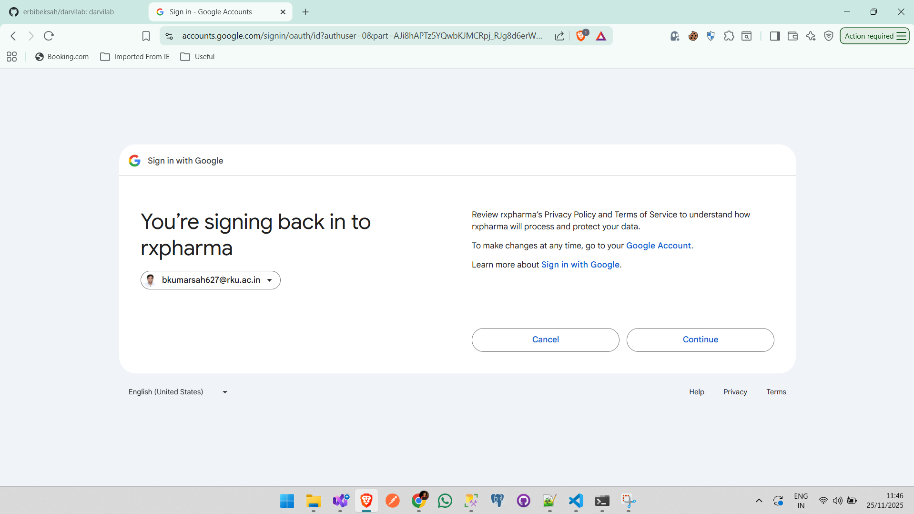
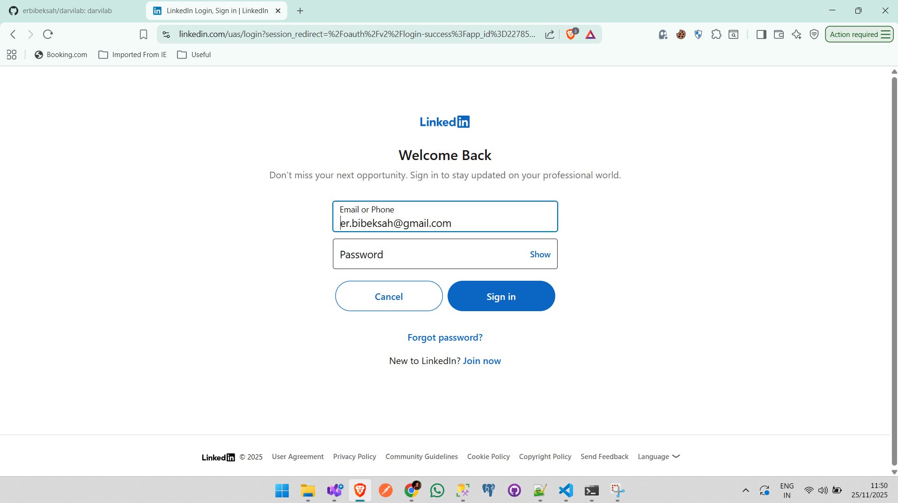
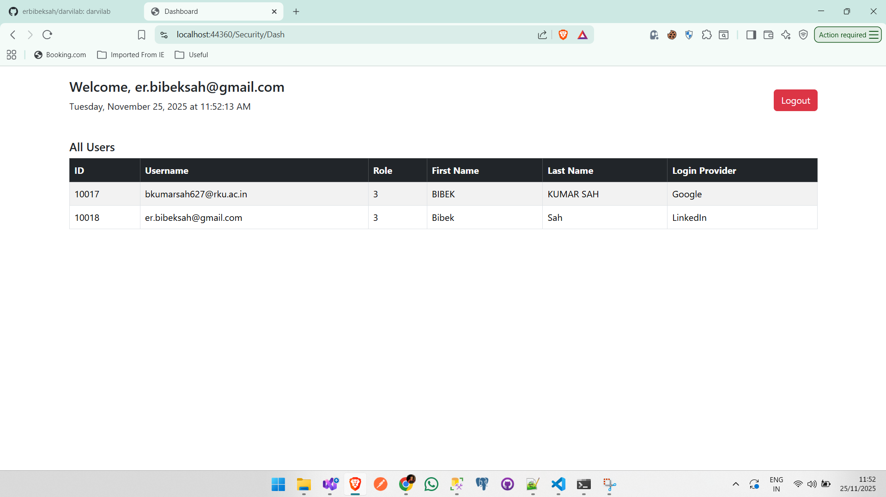
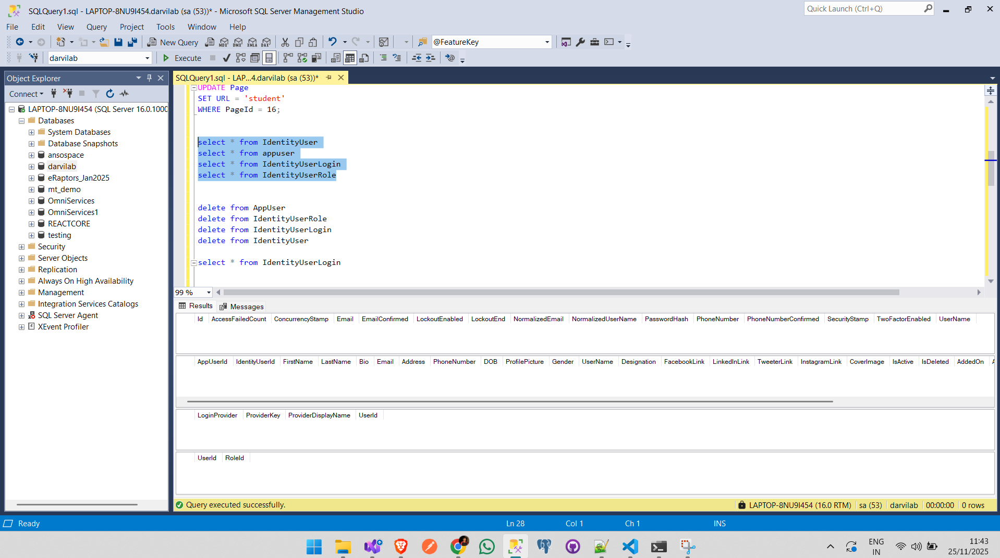
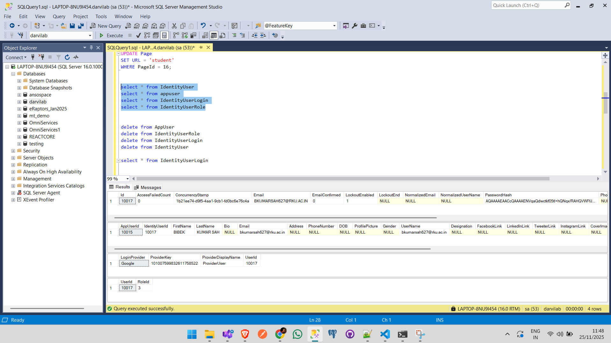
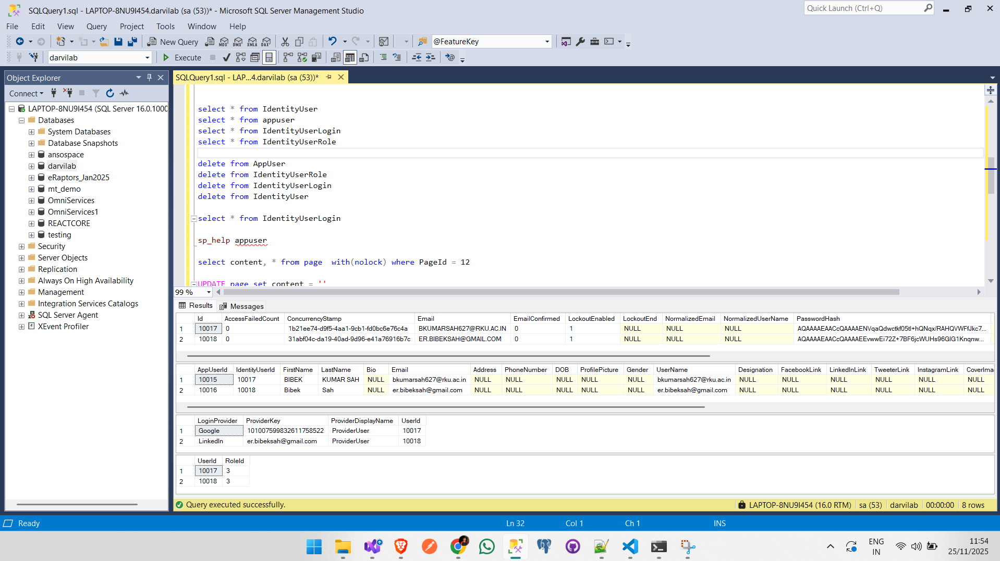
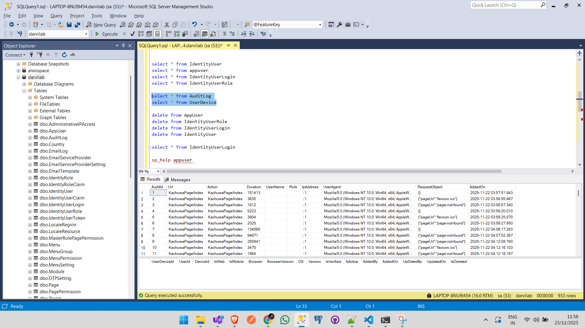
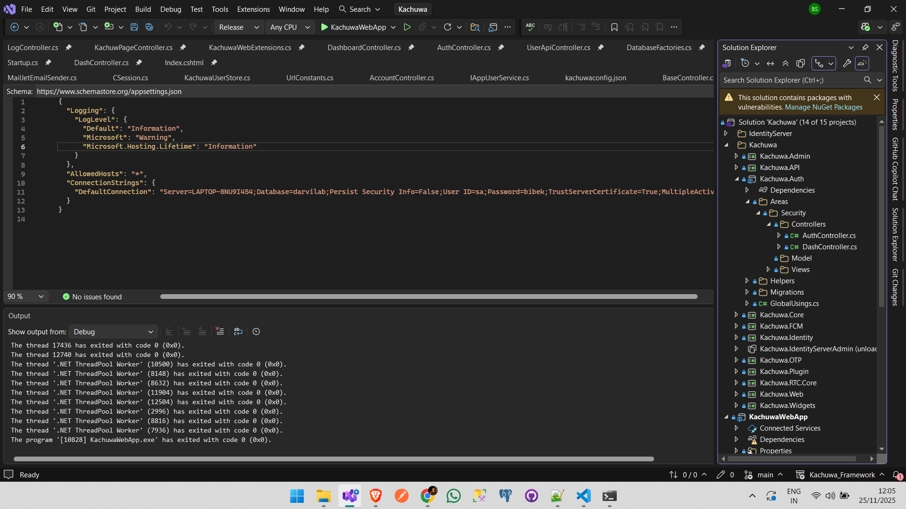

# Kachuwa.Auth Demo Project

[](https://github.com/erbibeksah/darvilab)

This project implements a simple authentication module using the existing structure of the **Kachuwa** modular monolithic .NET project. Since the Kachuwa repository does not provide templates or NuGet packages for direct integration, this solution extends the project by referencing its internal class libraries.

The goal of this demo is to showcase third-party authentication (Google and LinkedIn), a basic user dashboard, and logout functionality—implemented within the constraints of the original Kachuwa structure.

---

## 🚀 Project Overview

This demo includes:

- **Google OAuth 2.0 Authentication**
- **LinkedIn OAuth 2.0 Authentication**
- **Automatic user creation on first login**
- **User dashboard with basic profile details**
- **Secure logout functionality**

This demonstrates how modern authentication can be integrated into the existing Kachuwa architecture.

---

## 🔧 Implemented Features

### ✔ Third-Party OAuth Login
- Secure Google login  
- Secure LinkedIn login  
- OAuth token processing  
- User profile extraction (name, email, provider, etc.)

### ✔ Dashboard
After login, the user is redirected to a simple dashboard displaying:
- Name  
- Email  
- Login provider  
- Additional profile fields (based on provider response)

### ✔ Logout
- Session clearing  
- Redirect to login page  

---

## ⚙️ Technical Notes & Challenges

During development, several issues in the Kachuwa project were addressed:

- Assembly and project reference inconsistencies  
- UI and Node.js build issues  
- Dependencies built on **.NET 6**, which is now out of support  
- No available NuGet packages for direct consumption  

Despite these limitations, the project was extended successfully with OAuth authentication and functional UI components.

---

## 📂 Project Structure
```
/Kachuwa.Auth
│
├── Kachuwa.* # Base modules from original project
├── Auth # Google & LinkedIn OAuth logic
├── Controllers # Controllers for Auth & Dashboard
├── Views # Login, Dashboard, Layout
└── wwwroot # Static files
```
---

## 🖼️ Screenshots

### Login Page  


### Google / LinkedIn Authentication  






### DB Logs 





### Dashboard


### Project Structure

---

## ▶️ How to Run the Project

### 1. Clone the Repository  
```bash
git clone https://github.com/erbibeksah/darvilab.git
```
### 2. Configure OAuth Credentials
Inside `kachuwaconfig.json` file in project directory: /config
``` bash
"Authentication": {
      "GoogleClientId": "YOUR_GOOGLE_CLIENT_ID",
      "GoogleClientSecret": "YOUR_GOOGLE_CLIENT_SECRET",
      "GoogleInCallBackUrl": "/signin-google",
      "LinkedInClientId": "YOUR_LINKEDIN_CLIENT_ID",
      "LinkedInClientSecret": "YOUR_LINKEDIN_CLIENT_SECRET",
      "LinkedInCallBackUrl": "/signin-linkedin"
}
```
### 3. Restore & Build
``` bash
dotnet restore
dotnet build
```

### 4. Run the Application
``` bash
dotnet run
```
